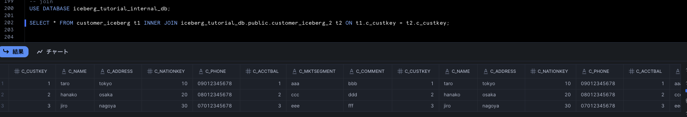
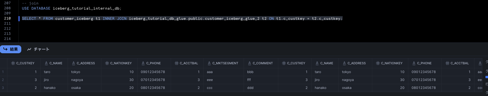
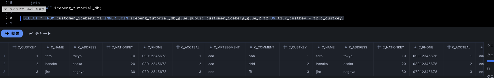

# Join検証

## 0. 概要
Snowflake内部テーブル、Snowflake管理のIcebergテーブル、外部カタログを取り込んだIcebergテーブルの間でJoinができるか検証する。<br>
それぞれ下記のようにデータを準備している。<br>
Snowflake内部テーブルはこちら。
```
CREATE OR REPLACE DATABASE iceberg_tutorial_internal_db;
USE DATABASE iceberg_tutorial_internal_db;

CREATE OR REPLACE TABLE customer_iceberg (
    c_custkey INTEGER,
    c_name STRING,
    c_address STRING,
    c_nationkey INTEGER,
    c_phone STRING,
    c_acctbal INTEGER,
    c_mktsegment STRING,
    c_comment STRING
)

CREATE OR REPLACE TABLE customer_iceberg_2 (
    c_custkey INTEGER,
    c_name STRING,
    c_address STRING,
    c_nationkey INTEGER,
    c_phone STRING,
    c_acctbal INTEGER,
    c_mktsegment STRING,
    c_comment STRING
)

INSERT INTO customer_iceberg VALUES
    (1,'taro', 'tokyo', 10, '09012345678',1,'aaa','bbb'),
    (2,'hanako', 'osaka', 20, '08012345678',2,'ccc','ddd'),
    (3,'jiro', 'nagoya', 30, '07012345678',3,'eee','fff')
;

INSERT INTO customer_iceberg_2 VALUES
    (1,'taro', 'tokyo', 10, '09012345678',1,'aaa','bbb'),
    (2,'hanako', 'osaka', 20, '08012345678',2,'ccc','ddd'),
    (3,'jiro', 'nagoya', 30, '07012345678',3,'eee','fff'),
    (4,'saburo', 'sendai', 40, '06012345678',4,'ggg','hhh'),
    (5,'shiro', 'hukuoka', 50, '05012345678',3,'iii','jjj')
;
```
Snowflake管理のIcebergテーブルはこちら。（前回までの資産はそのまま利用）
```
USE DATABASE iceberg_tutorial_db;

CREATE OR REPLACE ICEBERG TABLE customer_iceberg_2 (
    c_custkey INTEGER,
    c_name STRING,
    c_address STRING,
    c_nationkey INTEGER,
    c_phone STRING,
    c_acctbal INTEGER,
    c_mktsegment STRING,
    c_comment STRING
)
    CATALOG = 'SNOWFLAKE'
    EXTERNAL_VOLUME = 'iceberg_external_volume'
    BASE_LOCATION = 'customer_iceberg';

DELETE FROM customer_iceberg;

INSERT INTO customer_iceberg VALUES
    (1,'taro', 'tokyo', 10, '09012345678',1,'aaa','bbb'),
    (2,'hanako', 'osaka', 20, '08012345678',2,'ccc','ddd'),
    (3,'jiro', 'nagoya', 30, '07012345678',3,'eee','fff')
;

INSERT INTO customer_iceberg_2 VALUES
    (1,'taro', 'tokyo', 10, '09012345678',1,'aaa','bbb'),
    (2,'hanako', 'osaka', 20, '08012345678',2,'ccc','ddd'),
    (3,'jiro', 'nagoya', 30, '07012345678',3,'eee','fff'),
    (4,'saburo', 'sendai', 40, '06012345678',4,'ggg','hhh'),
    (5,'shiro', 'hukuoka', 50, '05012345678',3,'iii','jjj')
;
```
外部カタログを取り込んだIcebergテーブルは、まずGlueで下記を実行。
```
from pyspark.sql import SparkSession

spark = SparkSession.builder \
    .config("spark.sql.extensions", "org.apache.iceberg.spark.extensions.IcebergSparkSessionExtensions") \
    .config("spark.sql.catalog.glue_iceberg", "org.apache.iceberg.spark.SparkCatalog") \
    .config("spark.sql.catalog.glue_iceberg.warehouse", "s3://myicebergbucket202507202010/iceberg/") \
    .config("spark.sql.catalog.glue_iceberg.catalog-impl", "org.apache.iceberg.aws.glue.GlueCatalog") \
    .config("spark.sql.catalog.glue_iceberg.io-impl", "org.apache.iceberg.aws.s3.S3FileIO") \
    .getOrCreate()


spark.sql("CREATE DATABASE IF NOT EXISTS glue_iceberg.my_database")

query = """
CREATE TABLE IF NOT EXISTS glue_iceberg.my_database.customer_iceberg (
    c_custkey INTEGER,
    c_name STRING,
    c_address STRING,
    c_nationkey INTEGER,
    c_phone STRING,
    c_acctbal INTEGER,
    c_mktsegment STRING,
    c_comment STRING
)
USING iceberg
TBLPROPERTIES ('format-version'='2')
"""
spark.sql(query)

query = """
DELETE FROM glue_iceberg.my_database.customer_iceberg
"""
spark.sql(query)

query = """
INSERT INTO glue_iceberg.my_database.customer_iceberg VALUES(1,'taro', 'tokyo', 10, '09012345678',1,'aaa','bbb'),(2,'hanako', 'osaka', 20, '08012345678',2,'ccc','ddd'),(3,'jiro', 'nagoya', 30, '07012345678',3,'eee','fff')
"""
spark.sql(query)

query = """
CREATE TABLE IF NOT EXISTS glue_iceberg.my_database.customer_iceberg_2 (
    c_custkey INTEGER,
    c_name STRING,
    c_address STRING,
    c_nationkey INTEGER,
    c_phone STRING,
    c_acctbal INTEGER,
    c_mktsegment STRING,
    c_comment STRING
)
USING iceberg
TBLPROPERTIES ('format-version'='2')
"""
spark.sql(query)

query = """
INSERT INTO glue_iceberg.my_database.customer_iceberg_2 VALUES(1,'taro', 'tokyo', 10, '09012345678',1,'aaa','bbb'),(2,'hanako', 'osaka', 20, '08012345678',2,'ccc','ddd'),(3,'jiro', 'nagoya', 30, '07012345678',3,'eee','fff'),(4,'saburo', 'sendai', 40,'06012345678',4,'ggg','hhh'),(5,'shiro', 'hukuoka', 50, '05012345678',3,'iii','jjj')
"""
spark.sql(query)
```
その上でSnowflakeでは下記のように準備。（こちらも前回までの資産はそのまま利用）
```
USE DATABASE iceberg_tutorial_db_glue;


CREATE OR REPLACE ICEBERG TABLE customer_iceberg_glue_2
  CATALOG = 'glueCatalogInt'
  CATALOG_NAMESPACE  = 'my_database'
  CATALOG_TABLE_NAME = 'customer_iceberg_2'
  EXTERNAL_VOLUME = 'iceberg_external_volume_glue'
  AUTO_REFRESH       = TRUE
;
```

## 1. 検証
### 1.1 Snowflake内部テーブルとSnowflake管理のIcebergテーブル

できそうw<br>
左右反転は、、、
")
こちらもできそう。

### 1.2 Snowflake内部テーブルと外部カタログを取り込んだIcebergテーブル

できてる。<br>
左右反転は、、、
")
こちらもできそう。

### 1.3 Snowflake管理のIcebergテーブルと外部カタログを取り込んだIcebergテーブル

できてる。<br>
左右反転は、、、
")
こちらもできそう。

## 2. ここまでの結果
Snowflake内部テーブル、Snowflake管理のIcebergテーブル、外部カタログを取り込んだIcebergテーブルの間でJoinできそう。<br>
さらなるユースケースの磨き込みを。。| 観点             | Qlik（製品名も記載）                                                                                                    | Dataiku                                                               |
|------------------|------------------------------------------------------------------------------------------------------------------------|-----------------------------------------------------------------------|
| **外部コネクタ** | **Qlik Sense, Qlik Data Integration, Qlik SAP Connector**<br>多数のコネクタ（SAP, Salesforce, DB, クラウド等）を標準装備。特にSAP連携が強い。 | 多様なデータソースに接続可能。APIやカスタムコネクタも柔軟に作成可能。         |
| **ETL**          | **Qlik Data Integration（Replicate, Compose）**<br>GUIベースのETL/ELT。CDCやリアルタイム連携も得意。                   | GUIでノーコードETLが可能。複雑な前処理やPython/Rによる高度な変換も柔軟。      |
| **DWH**          | **Qlik Data Integration, Qlik Replicate**<br>DWHへのデータ連携・ロードが得意（Snowflake, BigQuery, Redshift等）。        | DWH連携も可能だが、主にデータ準備・加工・前処理に強み。                       |
| **アドホック分析**| **Qlik Sense**<br>インタラクティブな探索・アドホック分析が得意。連想型エンジンで直感的。                              | 分析用ダッシュボードも作成可能だが、主にデータサイエンス向けの分析が中心。     |
| **BI**           | **Qlik Sense, QlikView**<br>セルフサービスBI、ダッシュボード、レポート作成に強い。                                      | BI機能もあるが、Qlikほどの可視化・ダッシュボード機能はない。                  |
| **ML**           | **Qlik AutoML, Qlik Sense（Advanced Analytics Integration）**<br>ノーコードML。外部Python/R連携も可能。MLは補助的な位置付け。 | 機械学習・深層学習のGUI/コード両対応。AutoMLもあり、MLパイプライン構築が得意。 |
| **AI**           | **Qlik Sense（Insight Advisor, AutoML）**<br>AIアシスタント機能あり。主に分析支援や自動チャート生成。                   | データ準備・特徴量生成・モデル選定などAI支援が豊富。生成AI連携も